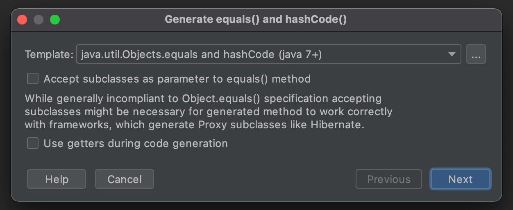

### 아이템10. equals는 일반 규약을 지켜 재정의하라

#### `equals`란?

```java
//Object.java
public boolean equals(Object obj) {
    return (this == obj);
}
```

- 다른 객체가 이 객체와 같은지( = 메모리상에서 같은 위치에 있는지) 여부를 나타냄
- 메모리 상에서 같은 위치에 있는지가 아니라 다른 기준으로 같음을 나타내고 싶을 때 재정의한다.

#### (참고)`instanceof` 란?

`a instanceof B` 

- "a객체는 B클래스의 인스턴스이거나 B클래스 하위 클래스의 인스턴스인가요?" 라는 뜻
- a가 null이면 `false`

#### `equals`를 재정의하면 안되는 경우

1. 각 인스턴스가 본질적으로 고유할때

   - 값을 표현하는 게 아닌 동작하는 개체를 표현하는 클래스일때 (예: `Thread`)

2. 인스턴스의 논리적 동치성을 검사할 일이 없을때

   - 논리적 동치성 검사의 예 : `java.util.regex.Pattern`의 `equals`

3. 상위 클래스에서 재정의한 `equals`가 하위 클래스에도 딱 들어맞을때

4. 클래스가 `private`이거나 `package-private`이고 `equals`를 호출할 일이 없을때

   - equals가 실수로라도 호출되는 걸 막고 싶을땐

     ```java
     @Override
     public boolean equals(Object o) {
         throw new AssertionError(); //호출 금지!
     }
     ```

#### `equals`를 재정의해야 하는 경우

1. 객체 식별성(메모리상의 같은 위치에 있는지)이 아니라 논리적 동치성을 확인해야 하는데 상위 클래스의 `equals`가 논리적 동치성 비교가 아닐때
   - 주로 값 클래스가 이에 해당 (`String`, `Integer`등..) 
   - 값 클래스라도 싱글톤이면, 또는 enum일땐 `equals`를 재정의하지 않아도 된다.

#### `equals`를 재정의할때 반드시 따라야 하는 요건 (동치관계를 만족시키기 위해)

- 반사성(reflexivity) : null이 아닌 모든 참조값 x에 대해, `x.equals(x)`는 true다.

  - 객체는 자기 자신과 같아야 한다

- 대칭성(symmetry) : null이 아닌 모든 참조값 x,y에 대해, `x.equals(y)`가 true면 `y.equals(x)`도 true다.

  - 두 객체는 서로에 대한 동치 여부에 똑같이 답해야 한다

  - ```java
    public final class CaseInsensitiveString {
        private final String s;
    
        public CaseInsensitiveString(String s) {
            this.s = Objects.requireNonNull(s);
        }
    
        //대칭성 위배
        @Override
        public boolean equals(Object o) {
            if (o instanceof CaseInsensitiveString)
                return s.equalsIgnoreCase(((CaseInsensitiveString) o).s);
            //String도 연동하겠다는 허황된 꿈을 버려라! CaseInsensitiveString만 비교하자
            if (o instanceof String)
                return s.equalsIgnoreCase((String) o);
            return false;
        }
    }
    ```

    ```java
    CaseInsensitiveString ABC = new CaseInsensitiveString("ABC");
    String abc = "abc";
    
    ABC.equals(abc) //true
    abc.equals(ABC) //false
    ```

- 추이성(transitivity) : null이 아닌 모든 참조값 x, y, z에 대해, `x.equals(y)`가 true이고 `y.equals(z)`도 true면, `x.equals(z)`도 true다.

  - 다음은 대칭성은 만족하지만 추이성을 위반한 코드다.

  - ```java
    public class Point {
        private final int x;
        private final int y;
    
        public Point(int x, int y) {
            this.x = x;
            this.y = y;
        }
    
        @Override
        public boolean equals(Object o) {
            if (!(o instanceof Point))
                return false;
            Point p = (Point)o;
            return p.x == x && p.y == y;
        }
    }
    ```

    ```java
    public class ColorPoint extends Point {
        private final Color color;
    
        public ColorPoint(int x, int y, Color color) {
            super(x, y);
            this.color = color;
        }
    
        //추이성 위반
        @Override
        public boolean equals(Object o) {
            if (!(o instanceof Point))
                return false;
          
            //Point와 비교할 땐 색상을 무시하고 있다.
            if (!(o instanceof ColorPoint))
                return o.equals(this);
            return super.equals(o) && ((ColorPoint) o).color == color;
        }
    }
    ```
    
    ```java
    ColorPoint redPoint = new ColorPoint(1, 2, Color.RED);
    Point point = new Point(1, 2);
    ColorPoint bluePoint = new ColorPoint(1, 2, Color.BLUE);
    
    redPoint.equals(point); //true
    point.equals(bluePoint); //true
    redPoint.equals(bluePoint); //false
    ```
    
    `redPoint`와 `point`와의 비교에서, 그리고 `point`와 `bluePoint`와의 비교는 색상을 무시했지만, `redPoint`와 `bluePoint`와의 비교에서는 색상을 고려했기 때문에 추이성이 깨졌다.
    
  - 이 문제를 해결하려면 상속대신 컴포지션을 사용하라.

    ```java
    public class ColorPoint {
        private final Point point;
        private final Color color;
    
        public ColorPoint(int x, int y, Color color) {
            point = new Point(x, y);
            this.color = Objects.requireNonNull(color);
        }
    
        @Override
        public boolean equals(Object o) {
            if (!(o instanceof ColorPoint))
                return false;
            ColorPoint cp = (ColorPoint) o;
            return cp.point.equals(point) && cp.color.equals(color);
        }
    }
    ```

- 일관성(consistency) : null이 아닌 모든 참조값 x,y에 대해, `x.equals(y)`를 반복해서 호출하면 항상 true를 반환하거나 false를 반환한다.

  - 불변 객체는 한번 같으면 끝까지 같아야 하고, 다르면 끝까지 달라야 한다
  - `equals`의 판단에 신뢰할 수 없는 자원이 끼어들게 해서는 안된다
  - `equals`는 항상 메모리에 존재하는 객체만을 사용한 결정적 계산만 수행해야 한다

- null-아님 : null이 아닌 모든 참조값 x에 대해, `x.equals(null)`은 false다.

  - 모든 객체가 null과 같지 않아야 한다
  - `NullPointerException`도 발생시키지 않아야 한다

#### 양질의 `equals`를 구현하는 단계

1. `==` 연산자를 사용해 입력이 자기 자신의 참조인지 확인한다
   - 단순 성능 최적화용
2. `instanceof` 연산자로 입력이 올바른 타입인지 확인한다
   - 같은 인터페이스를 구현한 클래스끼리 비교하고 싶을 땐 equals에서 인터페이스를 사용해야 한다 ex) `List`, `Map`, `Map.Entry`
3. 입력을 올바른 타입으로 형변환한다
   - 2단계에서 `instanceof `검사를 했기 때문에 100% 통과함
4. 입력 객체와 자기 자신의 대응되는 핵심 필드들이 모두 일치하는지 하나씩 검사한다
   - 필드가 어떤 타입일때 어떻게 비교해야 할까?
     - `float`, `double`을 제외한 기본 타입 : == 비교
     - `float`, `double` : 각각 `Float.compare(float, float)`, `Double.compare(double, double)`으로 비교
     - 참조 타입 : 각각의 `equals`로 비교
     - 배열 : 원소 각각을 지침대로 비교
   - 뭐부터 비교해야 할까?
     - 다를 가능성이 큰 것부터
     - 객체의 전체 상태를 대표하는 필드가 있다면 그 필드 먼저 비교하는게 효율적일 수도 있음

#### 주의사항

- equals를 재정의할땐 hashCode도 반드시 재정의하자

- 필드들의 동치성만 검사하고 너무 욕심부려서 비교하려 하지 말자

- 매개변수의 타입을 Object로 하라.

  ```java
  //이건 Object.equals를 override한게 아니라 overload한 것이다. 제대로 동작하지 않음
  public boolean equals(Person p) {
    ...
  }
  
  //매개변수를 항상 Object로 하자. @Override를 붙이는 습관은 컴파일 오류를 통해 뭐가 잘못됐는지 빠르게 알 수 있게 도와준다.
  @Override
  public boolean equals(Object o) {
    ...
  }
  ```

#### intelliJ의 `equals()`와 `hashCode()` 자동완성



```
[ ] equals()의 매개변수로 하위클래스 허용

일반적으로 Object.equals()의 사양을 준수하진 않지만, 생성된 메서드가 Hibernate와 같은 프록시 하위 클래스를 생성하는 프레임워크에서 올바르게 작동하려면 허용해야 할 수도 있습니다.
```

```java
public class Person extends Animal {

  private String name;

  public Person(String name) {
    this.name = name;
  }
}

----------------------------------------------------------------------

//허용 할때 (Object.equals()의 사양 준수X)
@Override
public boolean equals(Object o) {
  if (this == o) {
    return true;
  }
  if (!(o instanceof Person)) { //유일하게 다른 부분
    return false;
  }
  Person person = (Person) o;
  return Objects.equals(name, person.name);
}

@Override
public int hashCode() {
  return Objects.hash(name);
}


//허용 안할때 (Object.equals()의 사양 준수)
@Override
public boolean equals(Object o) {
  if (this == o) {
    return true;
  }
  if (o == null || getClass() != o.getClass()) { //유일하게 다른 부분
    return false;
  }
  Person person = (Person) o;
  return Objects.equals(name, person.name);
}

@Override
public int hashCode() {
  return Objects.hash(name);
}
```

#### 결론

필요하지 않다면 equals를 재정의하지 말라. 꼭 필요하다면 다섯 가지 규약을 지켜라.