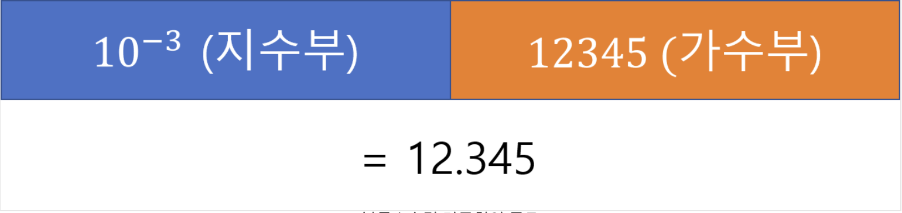

# 아이템 60 - 정확한 답이 필요하다면 float와 double은 피하라.

## float과 double의 문제

float과 double의 연산은 정확하지 않다.

```java
    @Test
    void 부동소수점_연산은_정확하지_않음 (){
        double result = 1.03 - 0.42;
        System.out.println(result); // 0.6100000000000001
        assertThat(result).isNotEqualTo(0.61);
    }
```

`1.03 - 0.42`와 같은 단순한 계산에서도 오차가 발생한다.

그 이유는 float과 double은 **부동소수점 방식**을 사용하고 있기 때문이다.

## 고정소수점과 부동소수점

컴퓨터는 숫자를 2진수로 표현한다.

이 때, 정수를 2진수로 표현하는 것은 문제가 없다.

하지만 소수점을 포함한 실수를 표현할 때는 상황이 조금 달라진다.

**소수점의 위치를 표현하고, 무엇이 정수 부분이고 무엇이 실수 부분인지 구분**해야 하기 때문이다.

컴퓨터는 이를 위해 `고정소수점` 방식과 `부동소수점` 방식을 사용한다.

### (1) 고정소수점 방식

고정소수점 방식은 `소수점의 위치를 고정`하는 것이다.

만약 실수를 표현하는 5비트의 **고정소수점 방식 자료형**이 있다고 가정해보자.

그리고 이 자료형은 2비트를 정수부로 사용하고 나머지 3비트를 실수부로 사용한다고 가정한다.


이 방법은 소수점의 위치가 고정되어 있기 때문에 정수를 표현하는 것과 똑같이 실수를 표현할 수 있다.

따라서 **오차 없는 정확한 연산이 가능**하다는 장점이 있고, 

반면에 **표현 범위가 제한적**이라는 단점이 있다.
```
12.345는 이 자료형으로 표현할 수 있지만
123.45 나 1234.5 는 표현할 수 없다.
```

### (2) 부동소수점 방식



반면에 고정 소수점 방식은 수를 정수/실수로 구분하지 않고

지수부와 가수부로 구분한다.

이와 같은 방법은 소수점이 고정되지 않으므로 더 **폭넓은 범위를 표현**할 수 있지만,

이 계산방식은 필연적으로 **오차가 발생**하여 근사값을 구한다고 한다.

자바의 float과 double은 이 부동소수점 방식으로 되어있다. (대부분의 언어에서 실수를 부동소수점 방식으로 표현한다.)

## 해결법은?

### (1) BigDecimal

```java
    @Test
    void BigDecimal을_활용한_연산() {
        BigDecimal b1 = new BigDecimal("1.03");
        BigDecimal b2 = new BigDecimal("0.42");
        String result = b1.subtract(b2).toString();
        System.out.println(result);	//0.61
        assertThat(result).isEqualTo("0.61");
    }
```

double형 대신 BigDecimal 객체를 사용하면 실수의 연산을 오차 없이 수행할 수 있다.

하지만 BigDecimal은 사용하기 번거롭고, 느리다.

### (2) 정수 타입을 이용

실수 타입을 정수 타입으로 사용하는 방법이다.

예를 들어 `0.1 달러 =  10센트`로 표현할 수 있다.

이 방법은 정수 기본형을 사용하기 때문에 연산도 정확하고, 사용하기도 편리하고, 빠르다.

다만, 모든 상황에서 이 방법을 사용할 수 있는 것은 아니다.


```
1 Satoshi = 0.00000001 BTC
```

